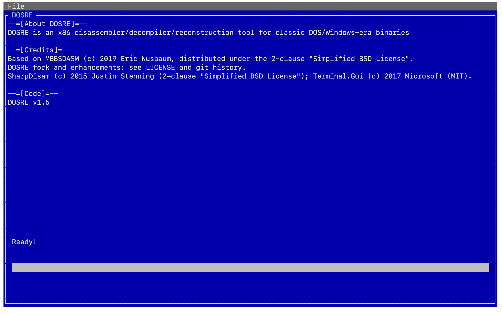

# DOSRE




**DOSRE** is an x86 Disassembler, Decompiler, and Reconstruction tool for classic DOS/Windows-era binaries. It focuses on 16-bit Segmented Executable File Format ("New Executable", or just NE), and also includes support for:

* DOS MZ EXE ("old" EXE header)
* DOS4GW LE (32-bit linear executables)

This project is intended to help with reverse engineering and reconstructing classic DOS games and applications from their original binaries.

# Text UI

**DOSRE** provides support for a cross-platform Text-Based UI (TUI) thanks to the fantastic Terminal.Gui library! To access the TUI, simply run DOSRE with no command line arguments.

# Example Command Line

**DOSRE** supports disassembly via command line as well.

Examples for DOS binaries:

* DOS MZ EXE (best-effort insights, limit output):
```
-i perform.EXE -o perform.disasm.txt -mzinsights -mzbytes 131072
```

If you also pass `-splitkb <n>` together with `-o`, DOSRE will split the output into numbered chunks using the pattern `out.001.asm`, `out.002.asm`, ... (the chunk number is inserted before the `.asm` extension).

* DOS4GW LE (insights + fixups/globals, limit output):
```
-i EUROBLST.EXE -o EUROBLST.disasm.txt -leinsights -lefixups -leglobals -lebytes 131072
```

# Current Features
**DOSRE** offers several disassembly/code analysis options that are configurable through the command line.

#### Minimal Disassembly (-minimal)
Minimal will output the disassembled x86 code segments labeled with SEGMENT:OFFSET with no additional analysis.

```asm
00000C68h:0002.0068h 83C408          add sp, 0x8
00000C6Bh:0002.006Bh 68FF7F          push 0x7fff
00000C6Eh:0002.006Eh 680180          push 0x8001
00000C71h:0002.0071h 6A07            push 0x7
00000C73h:0002.0073h 9AFFFF0000      call word 0x0:0xffff
00000C78h:0002.0078h 83C406          add sp, 0x6
00000C85h:0002.0085h 59              pop cx
00000C86h:0002.0086h 89160403        mov [0x304], dx
00000C8Ah:0002.008Ah A30203          mov [0x302], ax
```
#### Normal Disassembly (default)
Normal will output the disassembled x86 code segments labeled with SEGMENT:OFFSET as well as processing:
* Processing Segment Relocation Table Entries
* Resolve External References
* String Reference Resolution (best guess)
00000C6Bh:0002.006Bh 68FF7F          push 0x7fff
00000C6Eh:0002.006Eh 680180          push 0x8001
00000C71h:0002.0071h 6A07            push 0x7
00000C73h:0002.0073h 9AFFFF0000      call word 0x0:0xffff
00000C78h:0002.0078h 83C406          add sp, 0x6
00000C7Bh:0002.007Bh A3EC02          mov [0x2ec], ax
00000C7Eh:0002.007Eh 6A08            push 0x8
00000C80h:0002.0080h 9AFFFF0000      call word 0x0:0xffff
00000C85h:0002.0085h 59              pop cx
00000C86h:0002.0086h 89160403        mov [0x304], dx
00000C8Ah:0002.008Ah A30203          mov [0x302], ax
```

#### Additional Analysis Mode (-analysis)
Additional Analysis mode enables **DOSRE** to provide extra best-effort analysis (subroutine identification, compiler pattern hints like Turbo C++ FOR loops, and optional imported-function annotation when module definition JSON files are provided).

Additional disassembly analysis includes:
* Imported function labeling (when module definition JSON files are available)
* Provide method signatures in place of external ordinal calls (when definitions exist)
* Best-effort signature argument reconstruction for selected patterns
* Identify FOR loops generated by the Borland Turbo C++ compiler and label them
* Basic variable tracking and labeling

The Enhanced Analysis mode can be extended through pull requests by adding Module Definition JSON files for known libraries.
```asm
00000C68h:0002.0068h 83C408          add sp, 0x8
00000C6Bh:0002.006Bh 68FF7F          push 0x7fff
00000C6Eh:0002.006Eh 680180          push 0x8001
00000C71h:0002.0071h 6A07            push 0x7
00000C73h:0002.0073h 9AFFFF0000      call word 0x0:0xffff          ; int numopt(int msgnum,int floor,int ceiling);
                                                                   ; Resolved Signature: numopt(7, 32769, 32767)
                                                                   ; Retrieves a numeric option from MCV file
00000C78h:0002.0078h 83C406          add sp, 0x6
00000C7Bh:0002.007Bh A3EC02          mov [0x2ec], ax               ; Return value saved to 0x2ECh
00000C7Eh:0002.007Eh 6A08            push 0x8
00000C80h:0002.0080h 9AFFFF0000      call word 0x0:0xffff          ; char *string=stgopt(int msgnum);
                                                                   ; Resolved Signature: char *string=stgopt(8);
                                                                   ; Gets a string from an MCV file
00000C85h:0002.0085h 59              pop cx
00000C86h:0002.0086h 89160403        mov [0x304], dx
00000C8Ah:0002.008Ah A30203          mov [0x302], ax               ; Return value saved to 0x302h
                                                                   ; AX holds pointer, DX holds size in return from function
```
# What's Next
* Expand DOS-focused analysis
    * Improve INT 21h decoding, compiler/runtime pattern recognition (Borland/Watcom), and higher-level pseudo-C summaries
* Add support for 32-bit PE EXE/DLL (future)
    * Requires additional support for disassembly of PE format EXE/DLL files

# Reference Docs

This repo includes a `DosDocs/` folder with PDFs covering DOS assembly/interrupts and Borland/Watcom documentation. These are reference materials intended to inform disassembly annotations and reverse engineering notes.

# Interrupt Database Workflow (Recommended)

DOSRE ships with an embedded interrupt database, but you can scale it up safely using *local packs* and a *missing-interrupt recorder*.

### Local interrupt packs (not committed)

- Create a folder named `DosInterrupts/` in the repo root (or set `DOSRE_INTS_DIR` to another folder).
- Drop one or more `*.json` packs in that folder using the same schema as `DOSRE/Analysis/Assets/DOSINTS_def.json`.
- DOSRE will merge them at startup (best-effort).

`DosInterrupts/` is ignored by git.

### Record missing interrupt usage (opt-in)

- Set `DOSRE_DUMP_UNKNOWN_INTS=1`
- Run a disassembly
- DOSRE writes/updates `dosre.unknown-ints.txt` in the working directory

### Generate a JSON skeleton from the recorded list

- `dotnet run --project DOSRE -- -intskeleton out.json`
- `dotnet run --project DOSRE -- -intskeleton in.txt out.json`

# Thanks

The project makes use of [SharpDiasm](https://github.com/spazzarama/SharpDisasm) to do the actual Disassmebly of the Code Segments into 16-bit x86 Assembly Language.


# License / Copyright

DOSRE is Copyright (c) 2017 Eric Nusbaum and is distributed under the 2-clause "Simplified BSD License". 

SharpDisam is Copyright (c) 2015 Justin Stenning and is distributed under the 2-clause "Simplified BSD License". 

Terminal.Gui is Copyright (c) 2017 Microsoft Corp and is distributed under the MIT License

Portions of the project are ported from Udis86 Copyright (c) 2002-2012, Vivek Thampi <vivek.mt@gmail.com> https://github.com/vmt/udis86 distributed under the 2-clause "Simplified BSD License".
